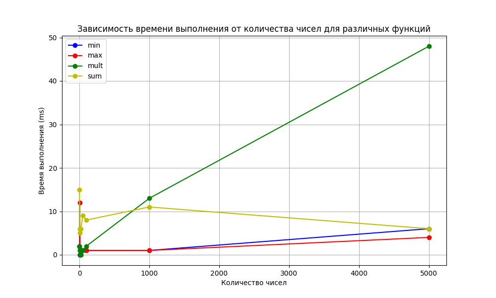

## Техническое задание №2 (ТЗ2)

### Часть №1 *Тестирование* (стоит 5 баллов из 10)

### Задание

Реализуйте на `Java` простейшую программу, которая будет считывать из файла числа, а далее отдельными функциями искать среди этих чисел минимальное число, максимальное число, считать их общую сумму и произведение.

Функции должны называться, соответственно `findMin` (минимальное число), `findMax` (максимальное число), `getSum` (сумма всех чисел), `getMult` (произведение всех чисел).

Числа в файле записаны в одной строке, друг от друга отделены пробелами. В файле есть минимум одно число. Максимально возможное количество чисел в файле - 1 млн.

Для этой программы подготовьте тесты:
- проверяющие корректность работы функций поиска минимума и максимума
- проверяющие корректность работы функций сложения и умножения
- проверяющие скорость работы программы при увеличении размера входного файла (*при увеличении количества чисел в файле*).
- проверающий корректность считывания чисел из файла огромного размера (реализован )

#### Пример работы

**В файле**: 1 4 2 3

**Минимальное**: 1

**Максимальное**: 4

**Сумма**: 10 *(1+2+3+4)*

**Произведение**: 24 *(1\*2\*3\*4)*

#### Критерии оценки

- `1 балл`: реализуйте функции чтения из файла, поиска минимального числа, поиска максимального числа, сложения и умножения *всех* чисел из файла
- `1 балл`: реализуйте тесты для проверки корректности функций поиска минимума, максимума, сложения и умножения
- `1 балл`: реализуйте тесты для проверки скорости работы программы при увеличении размера входного файла (для каждой из функций: поиск минимума, максимума, сложение и умножение)
- `1 балл`: реализуйте любой другой тест на ваше усмотрение
- `1 балл`: постройте график зависимости времени выполнения от кол-ва чисел в файле (*вы можете измерять время выполнения любой функции из реализованных на ваш выбор*)

### Часть №2 (стоит 5 баллов из 10)

### Задание

Теперь вам необходимо настроить CI-систему для своего мини-проекта.

#### Критерии оценки

- `1 балл`: заведите репозиторий для своего проекта на [GitHub](https://github.com/). Оформите простейший *README.md* ([туториал по markdown (файлы формата .md)](https://github.com/adam-p/markdown-here/wiki/Markdown-Cheatsheet)). Загрузите в репозиторий файлы своего мини-проекта (код, тесты, *README.md*).
- `1 балл`: подключите к вашему проекту любую CI-систему (**выше есть подсказки с вариантами систем, но мы крайне рекомендуем использовать GitHub Actions в рамках этого задания, только если Ваш семинарист не демонстрировал вам другую систему**). Обеспечьте возможность запуска тестов в ручном режиме (например, по щелчку кнопки в веб-интерфейсе CI-системы)
- `1 балл`: настройте CI таким образом, чтобы прогон тестов запускался автоматически при любом новом коммите в репозиторий вашего проекта
- `1 балл`: сделайте интеграцию CI-системы и вашего репозитория на GitHub: сделайте бэйдж в *README.md*, который будет показывать текущий статус тестов. Для информации смотрите [тут](https://docs.github.com/en/actions/monitoring-and-troubleshooting-workflows/adding-a-workflow-status-badge), [тут](https://www.codeblocq.com/2016/04/Add-a-build-passing-badge-to-your-github-repository/) или в аналогичном доке для выбранной вами CI-системы.  Как выглядят бэйджи в целом, можно посмотреть в любом проекте на GitHub, где они сделаны, например, в [репозитории Telegram](https://github.com/telegramdesktop/tdesktop)
- `1 балл`: сделайте любую интеграцию CI-системы и какого-либо мессенджера (например, `telegram`, `slack`, `msteams` и т.п.). Настройте систему так, чтобы при успешном прохождении теста посылалось сообщение "все ок", при неуспешном - посылалась информация, какие именно тесты не пройдены. **Обратите внимание**, тут не нужно *писать код*, тут нужно взять готовые аддоны / расширения и просто настроить

### Реализация
Проект реализован сборщиком `Maven`.

Все функции класса `NumberOperations` статичны и принимают в качестве параметра путь на файл с числами, с которыми требуется провести необходимые операции
- `getNumbersFromFile` (функция возвращает `ArrayList`, считанного из переданного файла с числами, является приватной и используется другими функциями класса `NumberOperations`)
- `findMin` (возвращает минимум среди чисел, находящихся в переданном файле)
- `findMax` (возвращает максимум среди чисел, находящихся в переданном файле)
- `getSum` (возвращает сумму чисел, находящихся в переданном файле)
- `getMult` (возвращает произведение чисел, находящихся в переданном файле)

Тестовый класс `NumberOperationsTest` реализован фреймворком `JUnit`. 
В нем реализованы 7 тестирующих функций:
- `findMin`
(тестирующая корректность работы функции поиска минимума среди чисел)
- `findMax` (тестирующая корректность работы функции поиска максимума среди чисел)
- `getSum` (тестирующая корректность работы функции, возвращающей сумму чисел)
- `getMult` (тестирующая корректность работы функции, возвращающей произведение чисел)
- `fileSizeIncrease` (тестирующая время работы всех функций при увелечении количества чисел в файле)
- `fileBigIntegerMillion` (тестирующая корректность считывания огромного количества очень больших чисел и время работы остальных функций)
- `testThrowsException` (тестирующая выброс RuntimeException при попытке использовать несуществующий файл в функциях класса NumberOperations)

12 тестовых файлов в формате `test{номер теста}.txt` используются для тестрирования выше описанных функций

Ответы на тесты лежат в файлах формата `test{номер теста}_ans.txt`

`mvn test`
эту команду вы можете использовать, чтобы запустить все тесты с помощью Maven

### График тестирования времени работы функций

Так как в умножении каждая операция треюует суммирование по всем перемноженным разрядам, в результате очень огромных чисел операция будет выполнять очень долгое время. 

Исходя из зависимости на графике можно понять, что асимптотическая сложность операции O(n^2) при n->infinity

А поиск максимума/минимума и суммы выполняется за линейный обход, поэтому на графике и возникает такая зависимость.
O(n) при n->infinity

